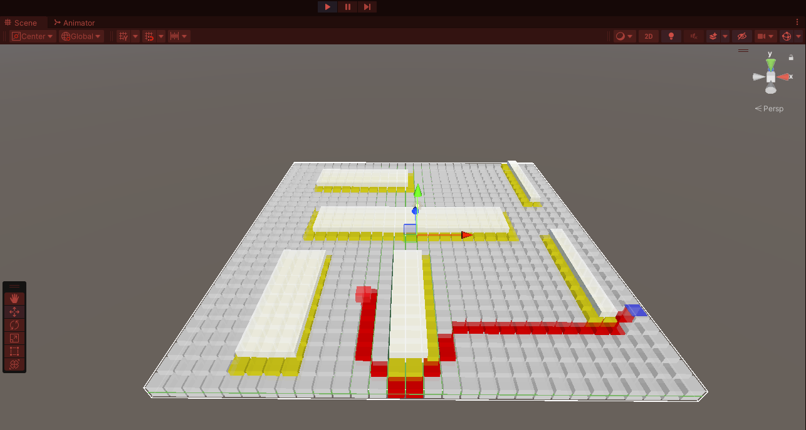

<H1 align="center" >Unity A Star Pathfinding Algorithm</H1>

<H3 align="center" >Description</H3>
This repository contains a Unity implementation of the A* (A-star) pathfinding algorithm. A* is a popular and efficient algorithm used in game development and robotics to find the shortest path between two points on a grid or graph.

Features
Heuristic-Based Search: Utilizes both the actual cost and estimated cost to prioritize paths, ensuring an optimal solution.
Grid-Based Navigation: Designed for 2D/3D grid environments, common in tile-based games.
Customizability: Easily adjustable parameters for heuristic functions, movement costs, and grid settings.
Efficient: Balances speed and accuracy, making it suitable for real-time applications.
How It Works
Grid Setup: The environment is divided into a grid where each cell represents a node. Nodes can be walkable or non-walkable (obstacles).
Start and End Nodes: The algorithm begins at the start node and aims to reach the end node, calculating possible paths based on the current state of the grid.
Open and Closed Lists: Nodes are evaluated and placed in either an open list (nodes to be evaluated) or a closed list (nodes that have been evaluated).
Pathfinding Process: The algorithm prioritizes nodes with the lowest f-cost (sum of g-cost and h-cost). The process continues until the path to the end node is found or all possible nodes have been evaluated.
Path Construction: Once the end node is reached, the path is constructed by backtracking from the end node to the start node.
Usage
Clone the repository and open it in Unity. You can find the A* pathfinding implementation in the Assets/Scripts directory. To integrate it into your project, attach the pathfinding script to an appropriate game object and configure the grid and nodes through the Unity Editor.

Examples
2D Grid Example: Demonstrates A* pathfinding on a 2D grid with obstacles.
3D Navigation: Shows how the algorithm can be adapted for 3D environments.
Contributing
Feel free to fork this repository and contribute by adding new features, optimizing the algorithm, or fixing bugs. Pull requests are welcome.

